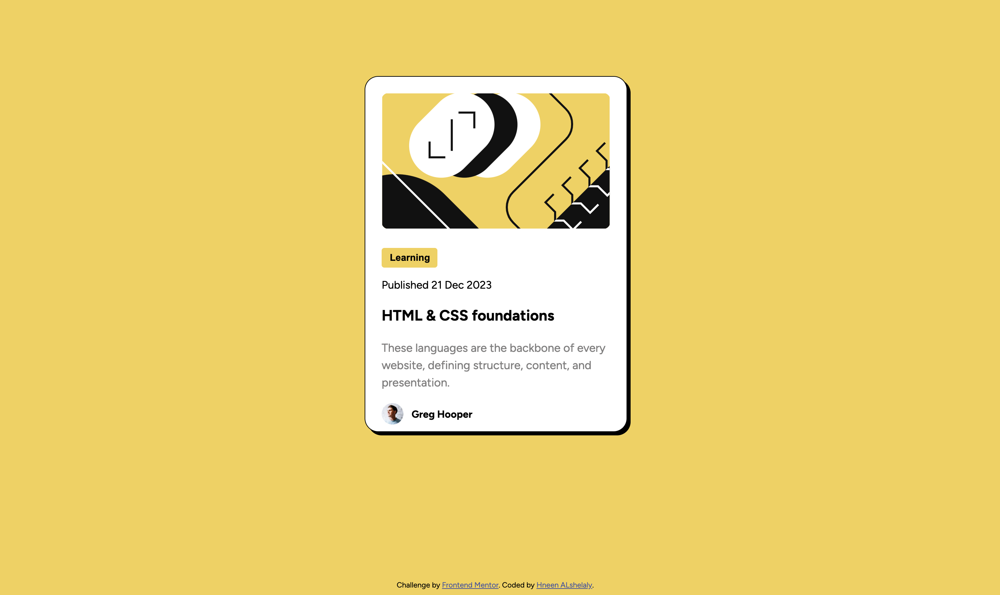
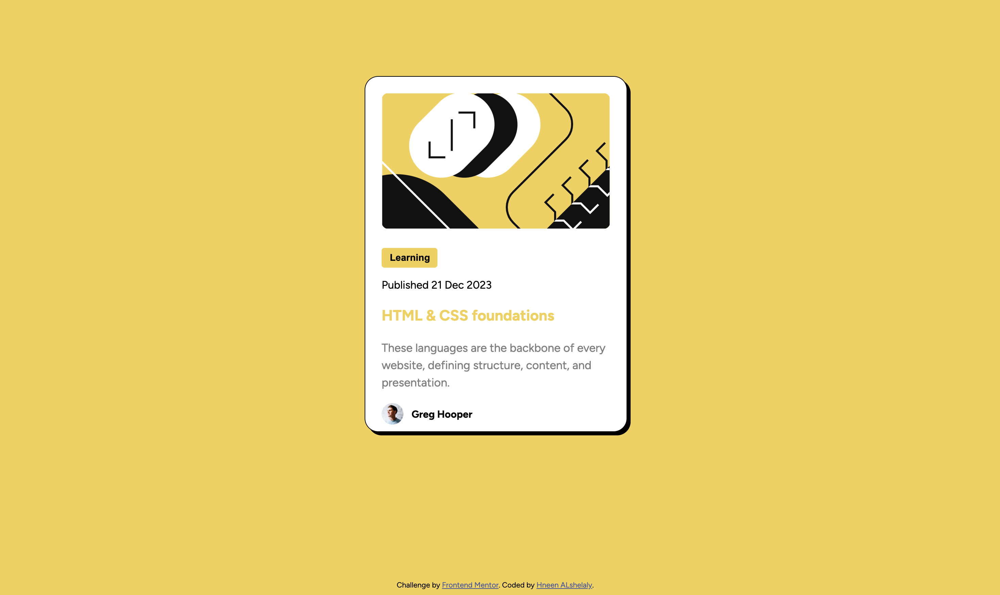

# Frontend Mentor - Blog preview card solution

This is a solution to the [Blog preview card challenge on Frontend Mentor](https://www.frontendmentor.io/challenges/blog-preview-card-ckPaj01IcS). Frontend Mentor challenges help you improve your coding skills by building realistic projects. 

## Table of contents

- [Overview](#overview)
  - [The challenge](#the-challenge)
  - [Screenshot](#screenshot)
  - [Links](#links)
- [My process](#my-process)
  - [Built with](#built-with)
  - [What I learned](#what-i-learned)
  - [Continued development](#continued-development)
  - [Useful resources](#useful-resources)
- [Author](#author)


## Overview

### The challenge


The challenge is to build out this blog preview card and get it looking as close to the design as possible.

Users should be able to:

- See hover and focus states for all interactive elements on the page

### Screenshot

my work :



with hover at the title (HTML & CSS foundations):


### Links

- Solution URL: [Add solution URL here](https://www.frontendmentor.io/solutions/blog-preview-card-using-only-html5-and-css3-Mzio56CW3-)
- Live Site URL: [Add live site URL here](https://hneenalshelaly.github.io/BlogPreviewCard/)

## My process

### Built with

- Semantic HTML5 markup
- CSS custom properties

### What I learned

- I tride to build this challenge using HTML5 and CSS3 only (since I get use to build it with Bootstrap)
- how to make div at the center with margen as it Specified at figma file

```css
.main-dev{
    width: 384px;
    height: 522px;
    border-radius: 20px;
    box-shadow: 5px  5px black;
    background-color: #ffff;
    border: 1px solid black;
    margin : 218.5px 528px;
}
```
- use figma for the first time to build this challenge 


### Continued development

Use this section to outline areas that you want to continue focusing on in future projects. These could be concepts you're still not completely comfortable with or techniques you found useful that you want to refine and perfect.

- I wanna to be more Confident with CSS3 (manipulating the margen and pading of element)
- Customise the responsive of the website Four different screen size 


### Useful resources

- [resource 1](https://www.joshwcomeau.com/css/center-a-div/) - This helped me for understading how margen help with centering the elements. I really liked this pattern and will use it going forward.


## Author

- Frontend Mentor - [@HneenAlshelaly](https://www.frontendmentor.io/profile/HneenAlshelaly)
- Twitter - [@nosta77lgic](https://www.twitter.com/nosta77lgic)

